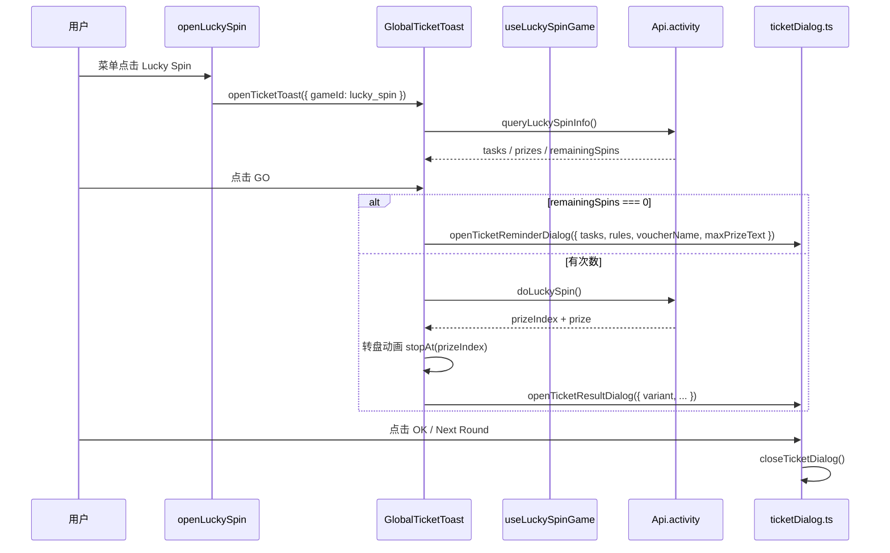
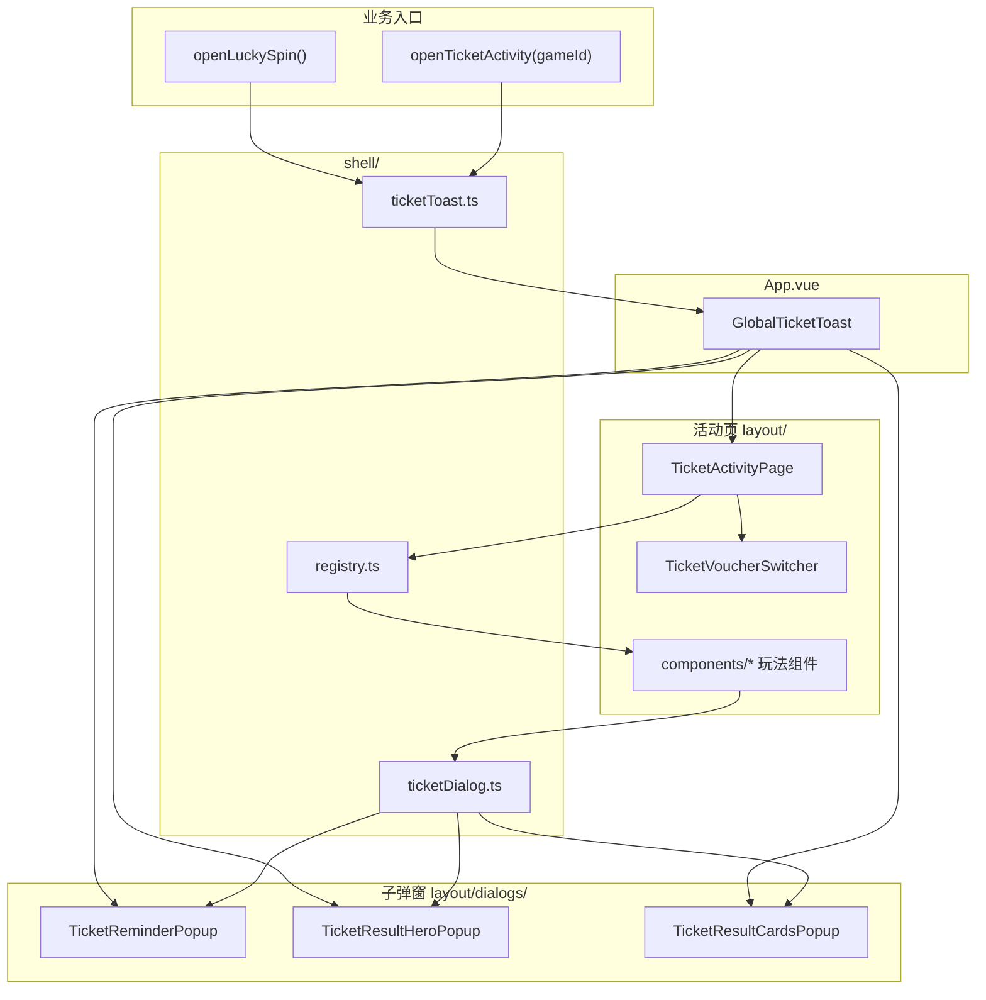

# 票券活动模块开发指南

> 路径：`src/views/activity/ticket/`  
> 入口组件：`GlobalTicketToast`（已在 `App.vue` 全局挂载，**只需挂载一次**）

---

## 模块概览

票券活动是一组**全屏 Teleport 弹窗**，包含 5 种玩法 + 若干子弹窗：

| 编号 | 类型   | gameId               | 中间区组件         | 实现状态  |
| ---- | ------ | -------------------- | ------------------ | --------- |
| 1    | 大转盘 | `lucky_spin`         | `LuckySpinWheel`   | ✅ 已实现 |
| 2    | 砸金蛋 | `golden_egg`         | `GoldenEggGrid`    | ⏳ 空壳   |
| 3    | 开盲盒 | `mystery_box`        | `MysteryBoxGrid`   | ⏳ 空壳   |
| 4    | 现金券 | `cash_voucher`       | `CashVoucherClaim` | ⏳ 空壳   |
| 5    | 红包   | `lucky_red_envelope` | `RedPacketOpen`    | ⏳ 空壳   |

子弹窗（叠在活动页之上）：

| 编号 | 场景                             | 组件                                                 | API                                                                        |
| ---- | -------------------------------- | ---------------------------------------------------- | -------------------------------------------------------------------------- |
| A    | 任务提醒（次数不足 / 点 ? 按钮） | `TicketReminderPopup` + `TicketReminderTasksContent` | `openTicketReminderDialog()`                                               |
| B    | 券解锁成功                       | `TicketReminderPopup` + `TicketTaskSuccessContent`   | `openTicketTaskSuccessDialog()`                                            |
| C    | 现金中奖                         | `TicketResultHeroPopup`                              | `openTicketResultDialog({ variant: 'cash' })`                              |
| D    | 再转一次                         | `TicketResultHeroPopup`                              | `openTicketResultDialog({ variant: 'spin_again' })`                        |
| E    | 未中奖                           | `TicketResultHeroPopup`                              | `openTicketResultDialog({ variant: 'no_prize' })`                          |
| F    | 票券中奖（单张 / 多张）          | `TicketResultCardsPopup`                             | `openTicketResultDialog({ variant: 'voucher_single' \| 'voucher_multi' })` |

### 端适配（移动端 / PC）

活动页与部分子弹窗按 `useIsMobile()` 分支渲染：

| 区域                  | 移动端                                                                                | PC（`md` 及以上）                                     |
| --------------------- | ------------------------------------------------------------------------------------- | ----------------------------------------------------- |
| 活动页容器            | 全屏纵向滚动，顶栏 ✕ / ?                                                              | 居中卡片 `max-w-[960px]`，左右分栏                    |
| 券种切换              | `TicketVoucherFooter` → `TicketVoucherSwitcher` **`carousel`**（5 个窗口 + 左右箭头） | 左侧栏 `TicketVoucherSwitcher` **`grid`**（5 列网格） |
| Header                | `align="center"`                                                                      | `align="start"`                                       |
| 大转盘尺寸            | `LUCKY_SPIN_TOKENS.wheelSize` + vw                                                    | `TICKET_PC_TOKENS.wheelSizePc`                        |
| 任务提醒弹窗          | 底部 Sheet                                                                            | 居中 Modal `max-w-[480px]`                            |
| Hero / Cards 结果弹窗 | `max-w-[320px]` 等                                                                    | 更宽上限（见 `TICKET_PC_TOKENS`）                     |

PC 尺寸 token 定义在 `shared/design-tokens.ts` → `TICKET_PC_TOKENS`。

---

## 快速对照：我该调哪个 API？

```
打开活动页（5 种玩法）
  ├─ 业务入口（含登录校验）→ openTicketActivity(gameId) / openLuckySpin()
  └─ 底层（无登录校验）    → openTicketToast({ gameId })

活动页内切换玩法（券种切换器：移动端轮播 / PC 网格）
  ├─ 点击图标 → GlobalTicketToast.handleGameSelect → switchTicketGame(gameId)
  └─ 或直接 switchTicketGame(gameId)

关闭
  ├─ 只关子弹窗           → closeTicketDialog()
  └─ 关活动页 + 子弹窗    → closeTicketToast()

打开子弹窗
  ├─ 任务提醒             → openTicketReminderDialog({ tasks, rules, voucherName?, maxPrizeText? })
  ├─ 券解锁成功           → openTicketTaskSuccessDialog({ voucherName, rules })
  └─ 抽奖结果             → openTicketResultDialog({ variant, ... })
```

---

## 一、打开 5 种活动弹窗（含完整示例）

### 推荐方式：业务入口（自动校验登录）

业务代码应优先使用 `@/utils/openTicketActivity` 或 `@/utils/openLuckySpin`。  
未登录时会弹出登录框，**不会**打开活动页。

```ts
import { openLuckySpin } from '@/utils/openLuckySpin'
import { openTicketActivity } from '@/utils/openTicketActivity'

// ① 大转盘
openLuckySpin()
// 等价于 ↓
openTicketActivity('lucky_spin')

// ② 砸金蛋
openTicketActivity('golden_egg')

// ③ 开盲盒
openTicketActivity('mystery_box')

// ④ 现金券
openTicketActivity('cash_voucher')

// ⑤ 红包
openTicketActivity('lucky_red_envelope')
```

#### 在 Vue 组件里绑定按钮

```vue
<script setup lang="ts">
import { openLuckySpin } from '@/utils/openLuckySpin'
import { openTicketActivity } from '@/utils/openTicketActivity'

const voucherMenus = [
  { label: 'Lucky Spin', onClick: () => openLuckySpin() },
  { label: 'Golden Egg', onClick: () => openTicketActivity('golden_egg') },
  { label: 'Mystery Box', onClick: () => openTicketActivity('mystery_box') },
  { label: 'Cash Voucher', onClick: () => openTicketActivity('cash_voucher') },
  { label: 'Red Envelope', onClick: () => openTicketActivity('lucky_red_envelope') }
]
</script>

<template>
  <button v-for="item in voucherMenus" :key="item.label" @click="item.onClick">
    {{ item.label }}
  </button>
</template>
```

#### 项目内已有引用（可直接对照）

| 文件                                               | 用法                                                 |
| -------------------------------------------------- | ---------------------------------------------------- |
| `src/components/Menu.vue`                          | 侧边栏 Vouchers 子菜单，5 个 handler 分别调上述 API  |
| `src/components/H5HomePop.vue`                     | 首页弹窗 → `openLuckySpin()`                         |
| `src/utils/contentJump.ts`                         | 运营位跳转 → `openLuckySpin()`                       |
| `src/views/activity/vouchers/myVouchers/shared.ts` | 我的票券「立即使用」→ 按票券 type 映射 gameId 后打开 |

`myVouchers` 中的映射逻辑示例：

```ts
import { openLuckySpin } from '@/utils/openLuckySpin'
import { openTicketActivity } from '@/utils/openTicketActivity'
import type { TicketGameId } from '@/views/activity/ticket'

const VOUCHER_GAME_ID_MAP: Record<string, TicketGameId> = {
  lucky_spin: 'lucky_spin',
  golden_egg: 'golden_egg',
  mystery_box: 'mystery_box',
  cash_voucher: 'cash_voucher',
  lucky_red_envelope: 'lucky_red_envelope'
}

function openVoucherGame(voucherType: string) {
  const gameId = VOUCHER_GAME_ID_MAP[voucherType]
  if (!gameId) return

  if (gameId === 'lucky_spin') {
    openLuckySpin()
    return
  }
  openTicketActivity(gameId)
}
```

### 底层方式：直接打开（无登录校验，适合调试）

```ts
import { openTicketToast, closeTicketToast, switchTicketGame } from '@/views/activity/ticket'
import type { TicketGameId } from '@/views/activity/ticket'

// 打开指定活动
openTicketToast({ gameId: 'mystery_box' })

// 活动页已打开时，切换中间玩法区（Footer 切换同理）
switchTicketGame('cash_voucher')

// 关闭活动页（会连带 closeTicketDialog）
closeTicketToast()
```

`openTicketToast` 还支持传入 header / ticker / footer / gameProps（目前大转盘主要读接口数据，这些字段预留给各玩法自行扩展）：

```ts
openTicketToast({
  gameId: 'lucky_spin',
  header: { title: 'Custom Title', subtitle: 'Win up to ₱888' },
  gameProps: { debug: true }
})
```

### 活动页内切换玩法（券种切换器）

底部/侧栏的玩法图标由 **`TicketVoucherSwitcher`** 统一渲染（逻辑在 `layout/composables/useTicketVoucherSwitcher.ts`）：

| 使用位置   | 包装组件                        | `variant`  | 交互                                  |
| ---------- | ------------------------------- | ---------- | ------------------------------------- |
| 移动端底部 | `TicketVoucherFooter`           | `carousel` | 最多可见 5 个图标，‹ › 翻页；点击选中 |
| PC 左侧栏  | `TicketActivityPage` 内直接引用 | `grid`     | 5 列网格一次展示全部                  |

用户点击图标 → `GlobalTicketToast.handleGameSelect` → `switchTicketGame(gameId)`：

```ts
// shell/ticketToast.ts
switchTicketGame('golden_egg') // 只改 globalTicketToastState.gameId，不重新 mount
```

`useTicketVoucherSwitcher` 负责：图标 fallback（`getGameIcon`）、选中项主题边框/光晕（`getTicketModalTheme`）、轮播窗口 `startIndex` 与 `activeIndex` 联动。

中间区组件由 `shell/registry.ts` 按 `gameId` 动态渲染：

```ts
// gameId → 组件
lucky_spin         → LuckySpinWheel
golden_egg         → GoldenEggGrid
mystery_box        → MysteryBoxGrid
cash_voucher       → CashVoucherClaim
lucky_red_envelope → RedPacketOpen
```

---

## 二、打开子弹窗（含完整示例）

子弹窗通过 `shell/ticketDialog.ts` 的全局 reactive state 驱动，**不需要**给 `GlobalTicketToast` 传 props。

> **调试提示**：可在浏览器控制台或任意已挂载组件里直接调用下列 API，前提是 `App.vue` 已挂载 `GlobalTicketToast`（项目默认已挂载）。

### A. 任务提醒 `openTicketReminderDialog`

**触发场景：**

- 用户点击活动页 `?`（移动端顶栏 / PC 卡片右上角）→ `GlobalTicketToast.handleOpenReminder`（自动带 `voucherName`、`maxPrizeText`）
- 大转盘次数为 0 时点击 GO → `useLuckySpinGame.handleWheelGo`（同样传入引导文案）

```ts
import { openTicketReminderDialog } from '@/views/activity/ticket'
import type { LuckySpinTask } from '@/views/activity/ticket'

const tasks: LuckySpinTask[] = [
  {
    id: 'bet-100',
    title: 'Total Bet > ₱100',
    progress: 50,
    finished: false,
    actionType: 'bet'
  },
  {
    id: 'deposit-100',
    title: 'Total Deposit > ₱100',
    progress: 100,
    finished: true,
    actionType: 'deposit'
  }
]

const rules = [
  'Promotion period and cash prize limits apply as stated on the platform.',
  'Rewards are automatically credited to your account balance.',
  'Vouchers expire according to the date shown on each voucher.'
]

openTicketReminderDialog({
  tasks,
  rules,
  voucherName: 'Lucky Spin', // 可选：顶部引导「完成以下任务以解锁 {券名}」
  maxPrizeText: '₱888' // 可选：引导「最高赢取 {金额} 现金」
})
```

当传入 `voucherName` 或 `maxPrizeText` 时，`TicketReminderTasksContent` 会展示两行引导文案（高亮券名/金额）。

`actionType: 'deposit'` 且未完成时，任务行会显示「Deposit」按钮，点击走 `goTicketDeposit()` 跳转充值页。已完成任务显示禁用态「已完成」按钮 + 进度百分比。

### B. 券解锁成功 `openTicketTaskSuccessDialog`

**触发场景：** 完成任务后后端通知券已解锁（目前 API 预留，业务可在任务完成回调里调用）。

```ts
import { openTicketTaskSuccessDialog } from '@/views/activity/ticket'

openTicketTaskSuccessDialog({
  voucherName: 'Golden Egg Voucher',
  rules: [
    'Your voucher has been added to My Vouchers.',
    'Use it before the expiry date shown on the voucher card.'
  ]
})
```

与任务提醒共用 `TicketReminderPopup` 壳层，内部根据 `kind === 'task_success'` 切换为 `TicketTaskSuccessContent`。

### C / D / E. Hero 结果弹窗（现金 / 再转 / 未中奖）

三种 variant 共用 `TicketResultHeroPopup`，由 `openTicketResultDialog` 写入 state 后自动展示。

```ts
import { openTicketResultDialog } from '@/views/activity/ticket'

// C. 现金中奖
openTicketResultDialog({
  variant: 'cash',
  highlightText: '₱100.00'
  // 可选覆盖默认 i18n 文案：
  // title: 'Congratulations!',
  // subtext: 'Credited to your wallet.',
  // buttonText: 'Next Round',
  // heroImage: '/path/to/custom.png'
})

// D. 再转一次
openTicketResultDialog({
  variant: 'spin_again',
  highlightText: 'Spin Again!'
})

// E. 未中奖
openTicketResultDialog({
  variant: 'no_prize',
  highlightText: 'No Prize'
})
```

大转盘真实业务中的映射逻辑（`useLuckySpinGame.openResult`）：

```ts
import { openTicketResultDialog } from '@/views/activity/ticket/shell/ticketDialog'
import type { LuckySpinResult } from '@/views/activity/ticket/shared/types'

function openResult(result: LuckySpinResult) {
  const { prize } = result

  if (prize.type === 'cash') {
    openTicketResultDialog({ variant: 'cash', highlightText: prize.label })
    return
  }
  if (prize.type === 'spin_again') {
    openTicketResultDialog({ variant: 'spin_again', highlightText: 'Spin Again' })
    return
  }
  if (prize.type === 'no_prize') {
    openTicketResultDialog({ variant: 'no_prize', highlightText: 'No Prize' })
    return
  }
  // 票券见下方 F
}
```

### F. Cards 结果弹窗（票券中奖）

单张用 `voucher_single`，多张用 `voucher_multi`（`vouchers.length > 1` 时自动选 multi）。

```ts
import { openTicketResultDialog } from '@/views/activity/ticket'
import type { LuckySpinVoucherCardData } from '@/views/activity/ticket'

// 单张票券
const singleVoucher: LuckySpinVoucherCardData[] = [
  {
    id: 'v-001',
    type: 'golden_egg', // 决定卡片背景色，见 shared/constants.ts VOUCHER_CARD_BG
    title: 'Golden Egg Voucher',
    rewardText: 'Win up to ₱888',
    expiresAt: '12/18/2026 11:14 AM'
  }
]

openTicketResultDialog({
  variant: 'voucher_single',
  vouchers: singleVoucher
})

// 多张票券
const multiVouchers: LuckySpinVoucherCardData[] = [
  {
    id: 'v-001',
    type: 'golden_egg',
    title: 'Golden Egg Voucher',
    rewardText: 'Win up to ₱888',
    expiresAt: '12/18/2026 11:14 AM'
  },
  {
    id: 'v-002',
    type: 'mystery_box',
    title: 'Mystery Box Voucher',
    rewardText: 'Win up to ₱500',
    expiresAt: '12/20/2026 09:00 AM'
  }
]

openTicketResultDialog({
  variant: 'voucher_multi',
  vouchers: multiVouchers
  // voucherCount 可省略，默认取 vouchers.length
})
```

`type` 可选值及卡片配色：

| type                 | 玩法   |
| -------------------- | ------ |
| `golden_egg`         | 砸金蛋 |
| `lucky_spin`         | 大转盘 |
| `cash_voucher`       | 现金券 |
| `lucky_red_envelope` | 红包   |
| `mystery_box`        | 开盲盒 |

### 关闭子弹窗

```ts
import { closeTicketDialog } from '@/views/activity/ticket'

closeTicketDialog() // 只关子弹窗，活动主页面仍在
```

---

## 三、本地调试：一键预览所有弹窗

在浏览器 DevTools 或临时调试按钮里粘贴以下代码，可依次预览全部 UI（需已登录或先用 `openTicketToast` 跳过登录）：

```ts
import { openTicketToast } from '@/views/activity/ticket'
import {
  openTicketReminderDialog,
  openTicketTaskSuccessDialog,
  openTicketResultDialog,
  closeTicketDialog
} from '@/views/activity/ticket'

// 1. 先打开活动页（调试时可跳过登录校验）
openTicketToast({ gameId: 'lucky_spin' })

// 2. 任务提醒
openTicketReminderDialog({
  tasks: [
    { id: '1', title: 'Total Bet > ₱100', progress: 30, finished: false, actionType: 'bet' },
    { id: '2', title: 'Total Deposit > ₱100', progress: 100, finished: true, actionType: 'deposit' }
  ],
  rules: ['Rule 1', 'Rule 2'],
  voucherName: 'Lucky Spin Voucher',
  maxPrizeText: '₱888'
})

// 3. 关闭后试券解锁（手动 closeTicketDialog 再开下一个）
closeTicketDialog()
openTicketTaskSuccessDialog({ voucherName: 'Lucky Spin Voucher', rules: ['Rule A'] })

// 4. Hero 结果三连
closeTicketDialog()
openTicketResultDialog({ variant: 'cash', highlightText: '₱88.00' })

closeTicketDialog()
openTicketResultDialog({ variant: 'spin_again', highlightText: 'Spin Again!' })

closeTicketDialog()
openTicketResultDialog({ variant: 'no_prize', highlightText: 'No Prize' })

// 5. 票券结果
closeTicketDialog()
openTicketResultDialog({
  variant: 'voucher_multi',
  vouchers: [
    {
      id: '1',
      type: 'golden_egg',
      title: 'Golden Egg',
      rewardText: '₱888',
      expiresAt: '12/18/2026'
    },
    {
      id: '2',
      type: 'mystery_box',
      title: 'Mystery Box',
      rewardText: '₱500',
      expiresAt: '12/20/2026'
    }
  ]
})
```

---

## 四、一次大转盘抽奖的完整链路



关键文件：

| 步骤         | 文件                                                            |
| ------------ | --------------------------------------------------------------- |
| 业务入口     | `src/utils/openLuckySpin.ts`、`src/utils/openTicketActivity.ts` |
| 活动页编排   | `GlobalTicketToast.vue`、`layout/TicketActivityPage.vue`        |
| 券种切换     | `layout/TicketVoucherSwitcher.vue`                              |
| 大转盘逻辑   | `components/lucky-spin/useLuckySpinGame.ts`                     |
| 子弹窗 state | `shell/ticketDialog.ts`                                         |
| Mock 数据    | `src/api/mock/luckySpin.ts`                                     |

---

## 五、架构与目录



```
ticket/
├── GlobalTicketToast.vue       # 总入口：活动页 + 全部子弹窗
├── index.ts                    # 对外 export
├── ticketToast.ts              # re-export → shell/ticketToast.ts
├── ticketDialog.ts             # re-export → shell/ticketDialog.ts
├── types.ts                    # re-export → shared/types.ts
│
├── shell/                      # 状态层：open/close API，不含 UI
│   ├── ticketToast.ts          #   活动页 visible + gameId
│   ├── ticketDialog.ts         #   子弹窗 kind + 内容数据
│   └── registry.ts             #   gameId → 玩法组件
│
├── layout/                     # 布局层：多玩法共用
│   ├── TicketActivityPage.vue  #   移动端全屏 / PC 双栏卡片
│   ├── TicketModalHeader.vue   #   align: center | start
│   ├── TicketWinnerTicker.vue
│   ├── TicketVoucherFooter.vue #   移动端底部，内嵌 Switcher carousel
│   ├── TicketVoucherSwitcher.vue
│   ├── composables/
│   │   └── useTicketVoucherSwitcher.ts
│   └── dialogs/
│       ├── TicketReminderPopup.vue
│       ├── TicketReminderTasksContent.vue
│       ├── TicketTaskSuccessContent.vue
│       └── result/             # Hero / Cards 结果弹窗
│
├── components/                 # 玩法层（每个活动一个文件夹）
│   ├── lucky-spin/             # ✅ 已实现
│   ├── golden-egg/             # ⏳ 空壳
│   ├── mystery-box/
│   ├── cash-voucher/
│   └── lucky-red-envelope/
│
└── shared/                     # 类型、常量、资源、主题 token
    ├── types.ts
    ├── constants.ts
    ├── assets.ts
    └── design-tokens.ts
```

### 分层职责

| 层级 | 目录                    | 职责                                          |
| ---- | ----------------------- | --------------------------------------------- |
| 入口 | `GlobalTicketToast.vue` | 挂载活动页 + 子弹窗，编排事件                 |
| 状态 | `shell/`                | 全局 open/close，组件零 props 读 state        |
| 布局 | `layout/`               | 活动页骨架、券种切换、Header/Footer、共用弹窗 |
| 玩法 | `components/`           | 各活动独立 UI 与 composable                   |
| 共享 | `shared/`               | 类型、常量、图片、主题                        |

### 全局 state 工作原理

```vue
<!-- GlobalTicketToast.vue — 子弹窗不传 props -->
<TicketReminderPopup />
<TicketResultHeroPopup />
<TicketResultCardsPopup />
```

```
openXxxDialog(data)
  → 写入 globalTicketDialogState（reactive）
  → 弹窗组件 computed 读 state，v-show 显示
  → 用户关闭 → closeTicketDialog()
```

---

## 六、API 类型速查

### 活动页 `shell/ticketToast.ts`

```ts
type TicketGameId =
  | 'lucky_spin'
  | 'golden_egg'
  | 'mystery_box'
  | 'cash_voucher'
  | 'lucky_red_envelope'

interface OpenTicketToastOptions {
  gameId: TicketGameId
  header?: Partial<TicketModalHeaderData>
  ticker?: TicketWinnerTickerData
  footer?: Partial<TicketVoucherFooterData>
  gameProps?: Record<string, unknown>
}

openTicketToast(options: OpenTicketToastOptions): void
closeTicketToast(): void          // 同时 closeTicketDialog()
switchTicketGame(gameId: TicketGameId): void
```

### 券种切换 `layout/TicketVoucherSwitcher.vue`

```ts
// Props（extends TicketVoucherFooterData）
interface TicketVoucherSwitcherProps {
  games: VoucherGameItem[]
  activeIndex: number
  totalVouchers: number
  activeGameId?: TicketGameId
  variant?: 'carousel' | 'grid'  // 默认 carousel
}

// Emits
select(index: number)
prev() / next()              // 仅 carousel
openVoucherList()
```

### 子弹窗 `shell/ticketDialog.ts`

```ts
type TicketDialogKind = 'none' | 'reminder' | 'task_success' | 'result'

type LuckySpinResultVariant =
  | 'cash'
  | 'spin_again'
  | 'no_prize'
  | 'voucher_single'
  | 'voucher_multi'

interface OpenTicketReminderDialogOptions {
  tasks?: LuckySpinTask[]
  rules?: string[]
  voucherName?: string // 任务列表上方引导文案（券名）
  maxPrizeText?: string // 任务列表上方引导文案（最高奖金）
}

interface OpenTicketTaskSuccessDialogOptions {
  voucherName: string
  rules?: string[]
}

interface OpenTicketResultDialogOptions {
  variant: LuckySpinResultVariant
  highlightText?: string // Hero 弹窗主文案（金额 / 提示语）
  vouchers?: LuckySpinVoucherCardData[]
  voucherCount?: number
  title?: string // 覆盖默认 i18n 标题
  subtext?: string
  heroImage?: string
  buttonText?: string
}

interface LuckySpinTask {
  id: string
  title: string
  progress: number // 0–100
  finished: boolean
  actionType?: 'deposit' | 'bet'
}

interface LuckySpinVoucherCardData {
  id: string
  type: VoucherCardType
  title: string
  rewardText: string
  expiresAt: string
  bgColor?: string
  icon?: string
}
```

### 后端接口 `Api.activity`

| 方法                   | 说明                                                     |
| ---------------------- | -------------------------------------------------------- |
| `queryLuckySpinInfo()` | 活动信息：奖品、任务、剩余次数、Footer 游戏列表          |
| `doLuckySpin()`        | 执行一次抽奖，返回 `prizeIndex` + `prize` (+ `vouchers`) |

Mock：`src/api/mock/luckySpin.ts`

---

## 七、常见改动指引

| 需求                  | 改哪里                                                                           |
| --------------------- | -------------------------------------------------------------------------------- |
| 菜单 / 首页打开某活动 | 调 `openTicketActivity(gameId)`，参考 `Menu.vue`                                 |
| 改活动页布局（含 PC） | `layout/TicketActivityPage.vue`、`shared/design-tokens.ts` → `TICKET_PC_TOKENS`  |
| 改券种切换 UI         | `layout/TicketVoucherSwitcher.vue`、`composables/useTicketVoucherSwitcher.ts`    |
| 改 Header / Footer    | `layout/TicketModalHeader.vue`、`TicketVoucherFooter.vue`（Footer 仅移动端包装） |
| 改大转盘逻辑          | `components/lucky-spin/`                                                         |
| 改 Hero 结果弹窗      | `layout/dialogs/result/TicketResultHeroPopup.vue`                                |
| 改票券结果弹窗        | `layout/dialogs/result/TicketResultCardsPopup.vue`                               |
| 改任务提醒 UI         | `layout/dialogs/TicketReminder*.vue`                                             |
| 改文案                | `src/i18n/locales/` → `luckySpinPage.*`                                          |
| 新增第 6 种活动       | 见下方 checklist                                                                 |

### 新增活动 checklist

1. `components/` 新建玩法文件夹 + 中间区组件
2. `shared/types.ts` 的 `TicketGameId` 增加枚举值
3. `shell/registry.ts` 注册 `gameId → 组件`
4. `shared/design-tokens.ts`、`gameHeaderConfig.ts`、i18n 补充 theme / 文案
5. `api/` 补充接口与类型
6. 玩法 composable 内按 `prize.type` 调 `openTicketResultDialog()`
7. `Menu.vue` / 运营入口增加 `openTicketActivity('new_game_id')`
8. 更新本文档

### 在其他模块复用结果弹窗 UI

若不在票券活动上下文使用，需自行挂载弹窗组件：

```ts
import {
  TicketResultHeroPopup,
  TicketResultCardsPopup
} from '@/views/activity/ticket/layout/dialogs/result'
import { openTicketResultDialog } from '@/views/activity/ticket'
```

挂载后同样通过 `openTicketResultDialog()` 驱动，无需 props。

---

## 八、注意事项

1. **`GlobalTicketToast` 只在 `App.vue` 挂载一次**，不要在 MainLayout 重复挂载。
2. **业务入口用 `openTicketActivity` / `openLuckySpin`**，不要绕过登录校验（除非本地调试）。
3. 子弹窗组件**不要**在 `GlobalTicketToast` 里传 props，统一读 `globalTicketDialogState`。
4. `closeTicketToast()` 会自动 `closeTicketDialog()`；只关子弹窗用 `closeTicketDialog()`。
5. 跨玩法共用 UI 放 `layout/`，不要塞进某个 `components/lucky-spin/` 子目录。
6. 目前仅 `lucky_spin` 有完整玩法逻辑；其余 4 个活动打开后会显示空壳组件 + 共用 Header/券种切换。
7. PC 与移动端共用 `TicketActivityPage`，分支由 `useIsMobile()` 控制；改 PC 宽度/分栏比例优先改 `TICKET_PC_TOKENS`。
8. 打开任务提醒时建议传入 `voucherName`、`maxPrizeText`（活动页 `?` 与 GO 次数为 0 时已自动传入）。

---

## 延伸阅读

- 子弹窗职责与扩展：[`layout/dialogs/README.md`](layout/dialogs/README.md)
- 结果弹窗 composable：`layout/dialogs/result/composables/`

---

## 变更记录

| 日期       | 说明                                                                          |
| ---------- | ----------------------------------------------------------------------------- |
| 2026-06-01 | 初版：GlobalTicketToast + 大转盘 + 4 活动空壳                                 |
| 2026-06-02 | 目录四层拆分；子弹窗全局 state 化；结果弹窗拆 Hero / Cards                    |
| 2026-06-02 | 重写文档：补充 5 种活动打开方式 + 全部子弹窗示例代码                          |
| 2026-06-02 | PC 双栏活动页、`TicketVoucherSwitcher`、任务提醒引导文案与 `TICKET_PC_TOKENS` |
