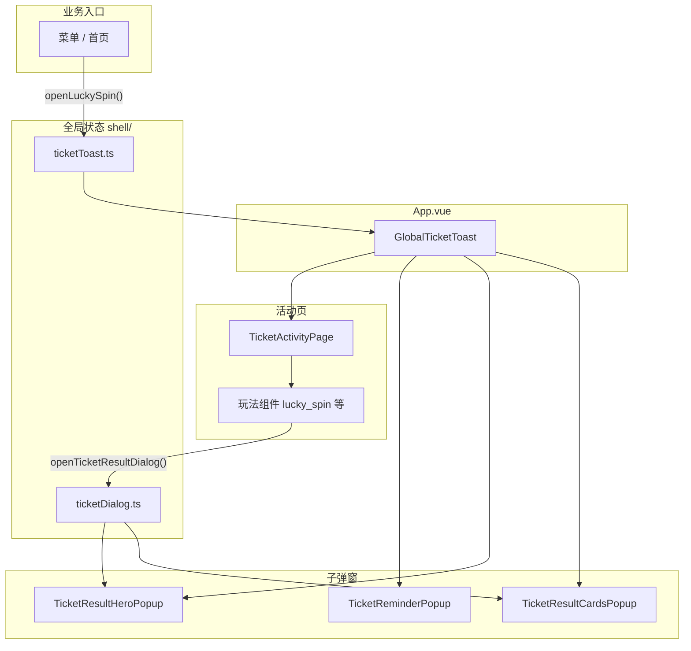
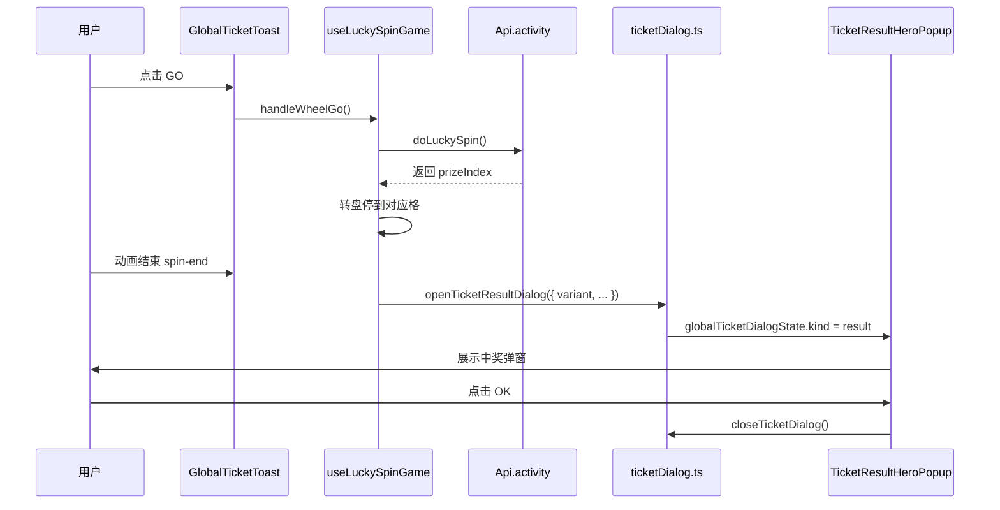

# 票券活动模块开发指南

> 路径：`src/views/activity/ticket/`  
> 入口组件：`GlobalTicketToast`（已在 `App.vue` 全局挂载）

---

## 这是什么？

票券活动是一组**全屏弹窗玩法**，包含大转盘、砸金蛋、开盲盒、现金券、红包等。用户从菜单或首页进入，在弹窗内完成抽奖/领奖，关闭后回到原页面。

**你只需要记住两件事：**

1. **打开活动页** → 调 `openLuckySpin()` 或 `openTicketToast()`
2. **打开子弹窗**（任务提醒、中奖结果等）→ 调 `openTicketXxxDialog()`

---

## 5 分钟上手

### 打开 / 关闭活动

```ts
import { openLuckySpin } from '@/utils/openLuckySpin'
import { closeTicketToast } from '@/views/activity/ticket'

openLuckySpin() // 打开大转盘（含登录校验）
closeTicketToast() // 关闭活动页（会连带关闭所有子弹窗）
```

### 打开子弹窗（调试或业务调用）

```ts
import {
  openTicketReminderDialog,
  openTicketResultDialog,
  closeTicketDialog
} from '@/views/activity/ticket'

// 任务提醒
openTicketReminderDialog({ tasks, rules })

// 现金中奖
openTicketResultDialog({ variant: 'cash', highlightText: '₱100.00' })

// 票券中奖
openTicketResultDialog({ variant: 'voucher_single', vouchers: [...] })

closeTicketDialog()  // 只关子弹窗，活动页仍在
```

---

## 整体架构



**分层原则（由外到内）：**

| 层级 | 目录                    | 职责                                |
| ---- | ----------------------- | ----------------------------------- |
| 入口 | `GlobalTicketToast.vue` | 挂载活动页 + 所有子弹窗，编排事件   |
| 状态 | `shell/`                | 全局 open/close API，不碰 UI        |
| 布局 | `layout/`               | 活动页骨架、Header/Footer、共用弹窗 |
| 玩法 | `components/`           | 各活动自己的 UI 与逻辑（如大转盘）  |
| 共享 | `shared/`               | 类型、常量、图片、主题 token        |

---

## 页面上有什么？

### 活动主页面（设计稿 #1）

`TicketActivityPage` 自上而下：

```
┌─────────────────────────────┐
│  ✕ 关闭          ? 任务提醒  │
├─────────────────────────────┤
│  TicketModalHeader          │  标题 / 倒计时
├─────────────────────────────┤
│  玩法区（按 gameId 切换）     │  如 LuckySpinWheel
├─────────────────────────────┤
│  TicketWinnerTicker         │  中奖滚动条
├─────────────────────────────┤
│  TicketVoucherFooter        │  底部活动切换 + 票券数
└─────────────────────────────┘
```

### 子弹窗一览

| 场景                 | 组件                                        | 打开方式                                                                    |
| -------------------- | ------------------------------------------- | --------------------------------------------------------------------------- |
| 任务提醒             | `TicketReminderPopup`                       | `openTicketReminderDialog()`                                                |
| 券解锁成功           | `TicketReminderPopup`（同一壳层，不同内容） | `openTicketTaskSuccessDialog()`                                             |
| 现金 / 再转 / 未中奖 | `TicketResultHeroPopup`                     | `openTicketResultDialog({ variant: 'cash' \| 'spin_again' \| 'no_prize' })` |
| 票券中奖             | `TicketResultCardsPopup`                    | `openTicketResultDialog({ variant: 'voucher_single' \| 'voucher_multi' })`  |

> 子弹窗细节见 [`layout/dialogs/README.md`](layout/dialogs/README.md)

---

## 目录结构

```
ticket/
├── GlobalTicketToast.vue       # 总入口（App 挂载这一个就够了）
├── index.ts                    # 对外 export API
├── ticketToast.ts              # → shell/ticketToast.ts（兼容 re-export）
├── ticketDialog.ts             # → shell/ticketDialog.ts
│
├── shell/                      # 【状态层】只管数据，不管 UI
│   ├── ticketToast.ts          #   活动页显隐、当前 gameId
│   ├── ticketDialog.ts         #   子弹窗 kind + 内容数据
│   └── registry.ts             #   gameId → 玩法组件映射
│
├── layout/                     # 【布局层】多个玩法共用
│   ├── TicketActivityPage.vue  #   活动主页面
│   ├── TicketModalHeader.vue
│   ├── TicketWinnerTicker.vue
│   ├── TicketVoucherFooter.vue
│   └── dialogs/                #   子弹窗（Reminder + Result）
│       └── result/             #   结果弹窗子模块（Hero / Cards）
│
├── components/                 # 【玩法层】每个活动独立文件夹
│   ├── lucky-spin/             #   ✅ 大转盘（已完整实现）
│   ├── golden-egg/             #   ⏳ 砸金蛋（空壳）
│   ├── mystery-box/            #   ⏳ 开盲盒（空壳）
│   ├── cash-voucher/           #   ⏳ 现金券（空壳）
│   └── lucky-red-envelope/     #   ⏳ 红包（空壳）
│
└── shared/                     # 【共享层】类型 / 常量 / 资源
    ├── types.ts
    ├── constants.ts
    ├── assets.ts
    └── design-tokens.ts
```

---

## 核心概念（新手必看）

### 1. 全局状态 + 零 props 挂载

子弹窗**不需要**在 `GlobalTicketToast` 里传 props：

```vue
<!-- GlobalTicketToast.vue -->
<TicketReminderPopup />
<TicketResultHeroPopup />
<TicketResultCardsPopup />
```

流程是：

```
业务代码调用 openXxxDialog(data)
        ↓
写入 globalTicketDialogState（shell/ticketDialog.ts）
        ↓
弹窗组件内部读取 state，自动显示
        ↓
用户点击关闭 → closeTicketDialog()
```

### 2. 两种结果弹窗

| 类型  | 组件                     | 适用 variant                       | UI 形态                   |
| ----- | ------------------------ | ---------------------------------- | ------------------------- |
| Hero  | `TicketResultHeroPopup`  | `cash` / `spin_again` / `no_prize` | 标题 + 金额 + 插图 + 按钮 |
| Cards | `TicketResultCardsPopup` | `voucher_single` / `voucher_multi` | 礼物盒 + 票券卡片列表     |

两者共用 `openTicketResultDialog()`，通过 `variant` 自动路由到对应弹窗。

### 3. 玩法注册表

`shell/registry.ts` 把 `gameId` 映射到中间区组件：

| gameId               | 组件               | 状态   |
| -------------------- | ------------------ | ------ |
| `lucky_spin`         | `LuckySpinWheel`   | 已实现 |
| `golden_egg`         | `GoldenEggGrid`    | 空壳   |
| `mystery_box`        | `MysteryBoxGrid`   | 空壳   |
| `cash_voucher`       | `CashVoucherClaim` | 空壳   |
| `lucky_red_envelope` | `RedPacketOpen`    | 空壳   |

---

## 一次抽奖的完整流程（大转盘示例）



关键文件：

- 玩法逻辑 → `components/lucky-spin/useLuckySpinGame.ts`
- 打开结果弹窗 → `shell/ticketDialog.ts` 的 `openTicketResultDialog()`
- 弹窗 UI → `layout/dialogs/result/TicketResultHeroPopup.vue`

---

## API 速查

### 活动页（`shell/ticketToast.ts`）

| 方法                          | 说明                    |
| ----------------------------- | ----------------------- |
| `openTicketToast({ gameId })` | 打开指定活动            |
| `closeTicketToast()`          | 关闭活动页 + 清空子弹窗 |
| `switchTicketGame(gameId)`    | Footer 切换活动         |

### 子弹窗（`shell/ticketDialog.ts`）

| 方法                                                  | 说明                              |
| ----------------------------------------------------- | --------------------------------- |
| `openTicketReminderDialog({ tasks, rules })`          | 任务提醒                          |
| `openTicketTaskSuccessDialog({ voucherName, rules })` | 券解锁成功                        |
| `openTicketResultDialog(options)`                     | 抽奖结果（Hero / Cards 自动分流） |
| `closeTicketDialog()`                                 | 关闭当前子弹窗                    |

### 后端接口（`Api.activity`）

| 方法                   | 说明                                 |
| ---------------------- | ------------------------------------ |
| `queryLuckySpinInfo()` | 获取活动信息（奖品、任务、剩余次数） |
| `doLuckySpin()`        | 执行一次抽奖                         |

Mock 数据：`src/api/mock/luckySpin.ts`

### 业务入口（推荐用法）

| 场景                  | 调用                               |
| --------------------- | ---------------------------------- |
| 菜单 / 首页打开大转盘 | `openLuckySpin()`                  |
| 打开其他活动          | `openTicketActivity('golden_egg')` |

---

## 我要改 / 加功能，去哪找？

| 需求               | 去哪改                                                    |
| ------------------ | --------------------------------------------------------- |
| 改活动页布局       | `layout/TicketActivityPage.vue`                           |
| 改 Header / Footer | `layout/TicketModalHeader.vue`、`TicketVoucherFooter.vue` |
| 改大转盘逻辑       | `components/lucky-spin/`                                  |
| 改中奖弹窗 UI      | `layout/dialogs/result/`                                  |
| 改任务提醒弹窗     | `layout/dialogs/TicketReminderPopup.vue`                  |
| 改文案             | `src/i18n/locales/` → `luckySpinPage.*`                   |
| 新增一种活动       | 见下方「新增活动 checklist」                              |

### 新增活动 checklist

1. `components/` 下新建玩法文件夹 + 组件
2. `shell/registry.ts` 注册 `gameId → 组件`
3. `shared/design-tokens.ts` 补充 theme（如需）
4. `shared/gameHeaderConfig.ts` + i18n 补充文案
5. `api/` 补充接口与类型
6. 玩法 composable 里调用 `openTicketResultDialog()` 展示结果
7. 更新本文档

### 复用结果弹窗（其他模块）

```ts
import {
  TicketResultHeroPopup,
  TicketResultCardsPopup
} from '@/views/activity/ticket/layout/dialogs/result'
```

挂载后配合 `openTicketResultDialog()` 即可，无需传 props。

---

## 注意事项

- `GlobalTicketToast` **只在 `App.vue` 挂载一次**，不要在 MainLayout 重复挂载
- 子弹窗组件**不要**在 `GlobalTicketToast` 里传 props，统一读 `globalTicketDialogState`
- 跨玩法共用的 UI 放 `layout/`，不要放进某个 `components/lucky-spin/` 子目录
- 关闭活动页 `closeTicketToast()` 会自动调用 `closeTicketDialog()`

---

## 延伸阅读

- 子弹窗职责与扩展：[`layout/dialogs/README.md`](layout/dialogs/README.md)
- 结果弹窗 composable 说明：见 `layout/dialogs/result/composables/` 内各文件注释

---

## 变更记录

| 日期       | 说明                                                        |
| ---------- | ----------------------------------------------------------- |
| 2026-06-01 | 初版：GlobalTicketToast + 大转盘 + 4 活动空壳               |
| 2026-06-02 | 目录四层拆分（shell / layout / components / shared）        |
| 2026-06-02 | 子弹窗全局 state 化；活动页抽离 TicketActivityPage          |
| 2026-06-02 | 结果弹窗拆为 TicketResultHeroPopup + TicketResultCardsPopup |
