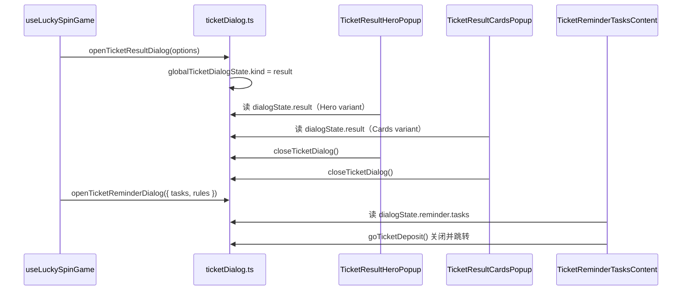

# layout/dialogs — 票券活动子弹窗

5 玩法共用的二级 overlay 弹窗，由 [`GlobalTicketToast.vue`](../../GlobalTicketToast.vue) 零 props 挂载。

详细模块说明见 [`../../README.md`](../../README.md)；本文档专注 **dialogs 目录内的职责划分与扩展方式**。

---

## 设计稿对照

| 编号 | 说明       | 壳层                     | 内容                          | 打开 API                                            |
| ---- | ---------- | ------------------------ | ----------------------------- | --------------------------------------------------- |
| #2   | 任务提醒   | `TicketReminderPopup`    | `TicketReminderTasksContent`  | `openTicketReminderDialog()`                        |
| #3   | 券解锁成功 | `TicketReminderPopup`    | `TicketTaskSuccessContent`    | `openTicketTaskSuccessDialog()`                     |
| #4   | 现金中奖   | `TicketResultHeroPopup`  | —                             | `openTicketResultDialog({ variant: 'cash' })`       |
| #5   | 再转一次   | `TicketResultHeroPopup`  | —                             | `openTicketResultDialog({ variant: 'spin_again' })` |
| #6   | 未中奖     | `TicketResultHeroPopup`  | —                             | `openTicketResultDialog({ variant: 'no_prize' })`   |
| —    | 票券中奖   | `TicketResultCardsPopup` | `TicketVoucherCard`（列表项） | `openTicketResultDialog({ variant: 'voucher_*' })`  |

关闭任意弹窗：`closeTicketDialog()`；关闭活动页会联动清空弹窗（`closeTicketToast()`）。

---

## 三层职责

```
*Popup（壳层）     → Teleport、遮罩、动画、关闭按钮；调 closeTicketDialog()
*Content（内容）   → 读 globalTicketDialogState 对应字段，渲染业务 UI
TicketVoucherCard  → 纯 props 展示，不读全局 state
```

| 文件                                | 层级     | 读 state                    | 写 state     |
| ----------------------------------- | -------- | --------------------------- | ------------ |
| `TicketReminderPopup.vue`           | 壳层     | `kind` / rules              | 关闭         |
| `result/TicketResultHeroPopup.vue`  | 独立弹窗 | `result.*`（Hero variant）  | 关闭         |
| `result/TicketResultCardsPopup.vue` | 独立弹窗 | `result.*`（Cards variant） | 关闭         |
| `TicketReminderTasksContent.vue`    | 内容     | `reminder.tasks`            | Deposit 跳转 |
| `TicketTaskSuccessContent.vue`      | 内容     | `taskSuccess.*`             | —            |
| `result/TicketVoucherCard.vue`      | 零件     | —                           | —            |

---

## 状态流



**谁写 state**：玩法 composable（如 `useLuckySpinGame`）、页面编排（如 `handleOpenReminder`）  
**谁读 state**：`*Popup` / `*Content` 组件内部  
**谁关 state**：壳层 OK/遮罩/关闭按钮 → `closeTicketDialog()`；Deposit → `goTicketDeposit()`

---

## 目录结构

```
dialogs/
├── README.md                       # 本文档
├── composables/
│   ├── useTicketDialogVisible.ts   # Reminder kind → visible / contentComponent
│   └── goTicketDeposit.ts          # 关闭弹窗 + 跳转充值
├── result/                         # 结果弹窗子模块（可跨玩法复用）
│   ├── index.ts                    # barrel 导出
│   ├── constants.ts                # TICKET_RESULT_HERO/CARDS_VARIANTS
│   ├── TicketResultHeroPopup.vue   # #4~6 插图型结果
│   ├── TicketResultCardsPopup.vue  # 票券卡片列表型结果
│   ├── TicketVoucherCard.vue       # 票券卡片
│   └── composables/
│       ├── useTicketResultHeroDialog.ts
│       ├── useTicketResultCardsDialog.ts
│       ├── useTicketResultHeroCopy.ts
│       └── useTicketResultCardsCopy.ts
├── _dialog-transitions.scss        # 共用 popup-fade / sheet / center-scale 动画
├── TicketReminderPopup.vue         # #2/#3 壳层
├── TicketReminderTasksContent.vue  # #2 内容
└── TicketTaskSuccessContent.vue    # #3 内容
```

Z-index 常量：`shared/constants.ts` → `TICKET_DIALOG_Z`。

---

## 扩展指南：新增一种弹窗 kind

1. 在 [`shell/ticketDialog.ts`](../../shell/ticketDialog.ts) 增加 `TicketDialogKind`、state 字段、`openTicketXxxDialog()` / 更新 `closeTicketDialog()` 重置逻辑
2. 新建 `*Content.vue`（若有独立内容区）或扩展现有 Popup 的 variant 分支
3. 结果弹窗在 `result/composables/` 的 `useTicketResultHeroDialog` / `useTicketResultCardsDialog` 中补充 `visible` 条件
4. 在 [`../../README.md`](../../README.md) 设计稿对照表补一行
5. 跑 `vue-tsc`，手动冒烟打开/关闭/遮罩点击

---

## 禁止事项

- **不在** `GlobalTicketToast` 给弹窗传 props 或绑事件（弹窗自读 `globalTicketDialogState`）
- **不在** `*Content` 里写 Teleport / 遮罩（交给 `*Popup` 壳层）
- **不在** `result/TicketVoucherCard` 读全局 state（保持纯展示，便于 Storybook / 单测）
- **不** 引入 wallet/payment 的 `popShell`（z-index 与动画约定不同）
